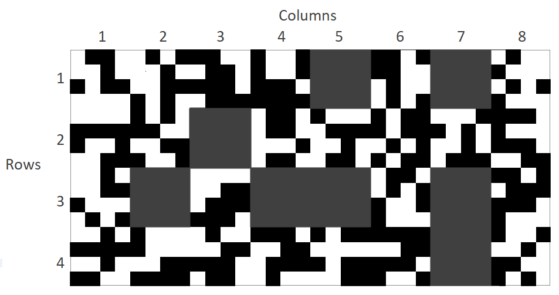

# Automous Rover Project
Developed in the fall of 2017 for MIE444 - Mechatronics Principle course. The goal was to design, build, and program an autonomous rover capable of autonomously meeting the following requirements in a known maze environment:

1) Localize and determine its position in the maze
2) Find the loading zone, where a wooden 2" x 2" x 2" cube is located
3) Pick up the cube and bring it to a drop off zone specified at the start of the run

Additional bonus requirements:

- Complete all the tasks in 60 seconds (+10%)
- Complete all the tasks in 90 seconds (+5%)
- Start the run with an unknown rover orientation (+5%)
- Pick up the blog at a randomly placed location in the loading zone (+15%)

Deductions:

- 5% penalty per obstacle hit or rover 'reset'

In its first evaluation trial, our rover completed all objectives in 64 seconds with an unknown starting orientation!

Videos and Pictures can be found here:
https://drive.google.com/drive/folders/1WRKHp-1NJoPO9iQMZuG6WGjnE88bWr78?usp=sharing
